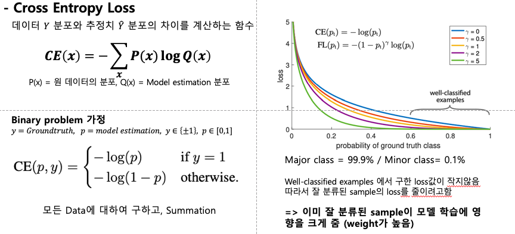
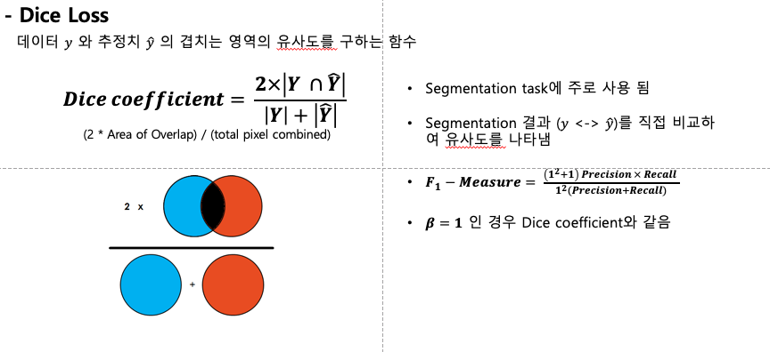
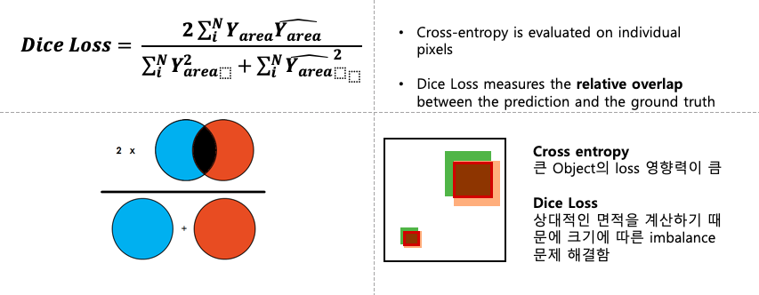
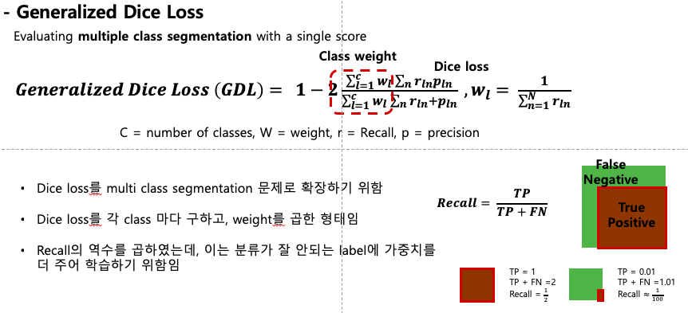
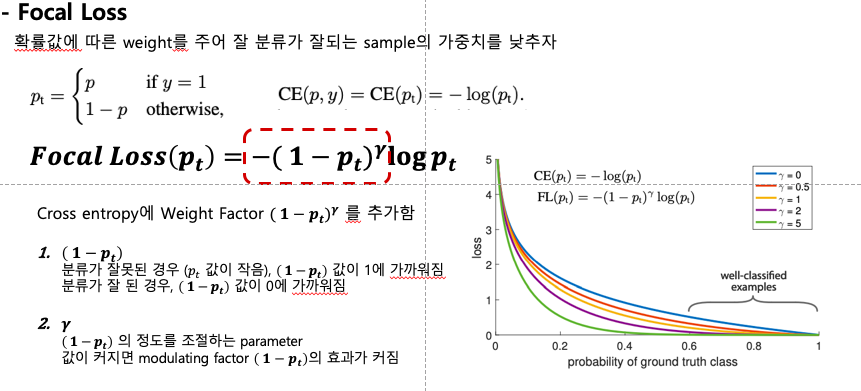

## Loss function

- Semantic segmentation

### Semantic segmentation loss

----

Semantic segmentation 에 사용되는 loss들

#### Cross Entropy Loss
  

#### Dice Loss
  
  

#### Generalised Dice loss
  

#### Focal Loss
  

### Reference

- Cross entropy loss : [https://ratsgo.github.io/deep%20learning/2017/09/24/loss/](https://ratsgo.github.io/deep learning/2017/09/24/loss/) 
- Dice coefficient, loss : https://towardsdatascience.com/metrics-to-evaluate-your-semantic-segmentation-model-6bcb99639aa2
- Dice vs IoU : https://stats.stackexchange.com/questions/273537/f1-dice-score-vs-iou/276144#276144
- Generalised Dice loss :
- Focal loss :  